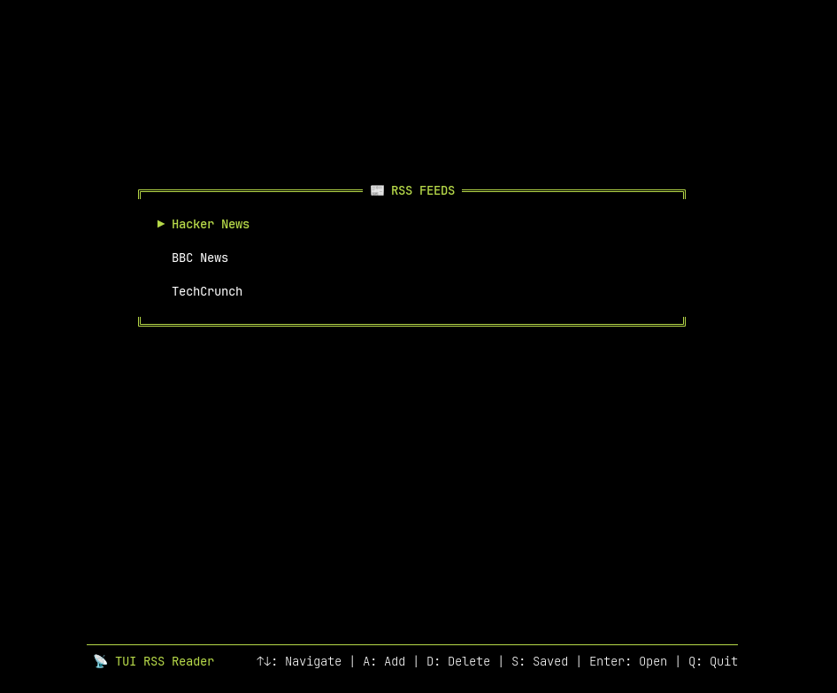

# TUI RSS Reader

A terminal-based RSS feed reader built with OpenTUI, featuring keyboard navigation, favorites management, and full article rendering.



## Features

- 📰 **RSS/Atom Support** - Parse both RSS 2.0 and Atom feeds
- ⌨️ **Keyboard Navigation** - Full keyboard control with context-aware shortcuts
- ⭐ **Favorites** - Save your favorite articles with persistent storage
- 📖 **Article Reader** - Read full articles with HTML-to-text rendering
- 💾 **Data Persistence** - Automatically saves feeds and favorites to `~/.tui-rss/`

## Installation

```bash
bun install
```

## Usage

```bash
bun run dev
```

## Build & Install

Compile to a standalone binary:

```bash
bun build --compile --minify ./src/index.tsx --outfile rss
```

Install:

```bash
sudo cp rss /usr/local/bin/
rss
```

## Default Feeds

The app comes pre-configured with:

- Hacker News
- TechCrunch

## Data Storage

All data is stored in `~/.tui-rss/data.json` including:

- Feed subscriptions
- Favorite articles

## Inspiration

This project is inspired by [terminal.shop](https://terminal.shop) and uses [Mozilla Readability](https://github.com/mozilla/readability) for clean article rendering.

## Built With

- [OpenTUI](https://opentui.com) - Terminal UI framework
- [Bun](https://bun.sh) - JavaScript runtime
- [@mozilla/readability](https://github.com/mozilla/readability) - Article content extraction
- TypeScript + React
